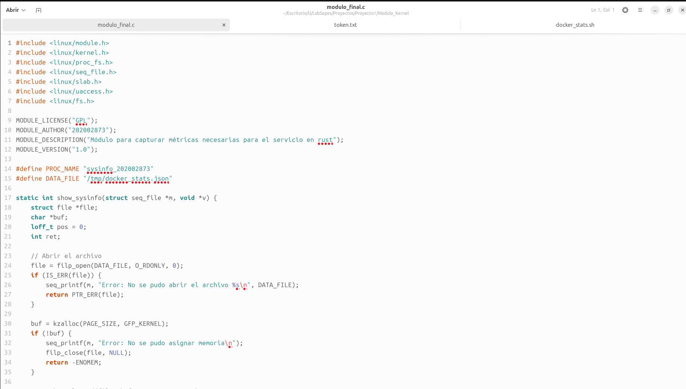
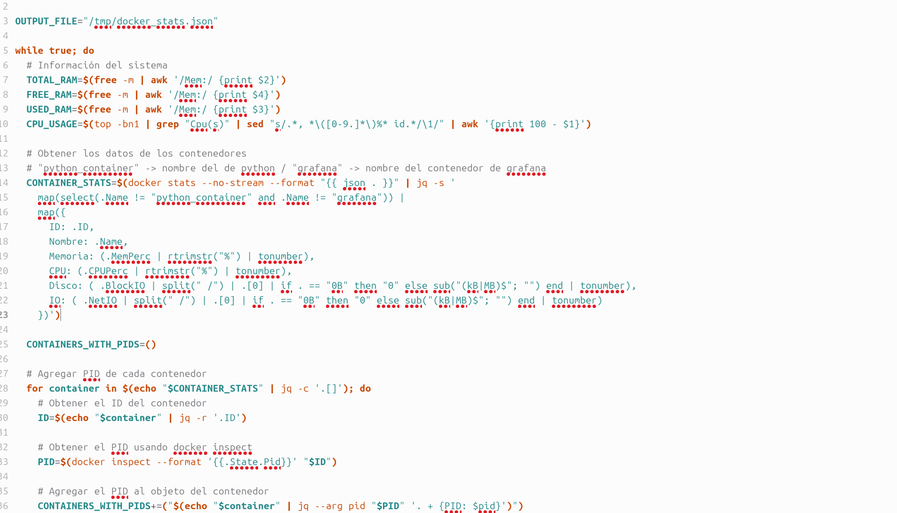
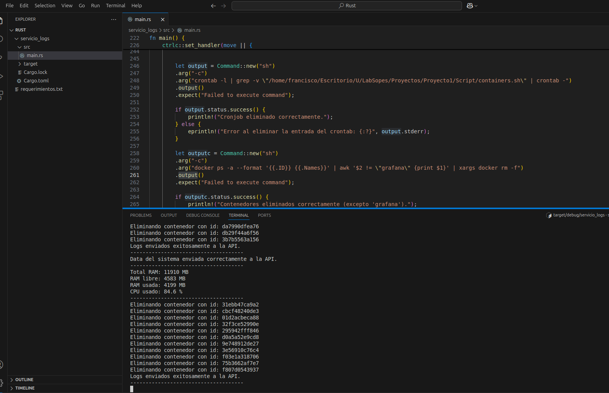
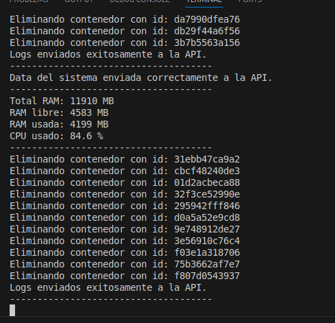
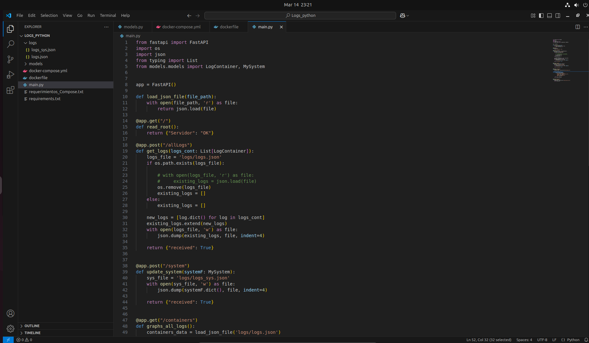
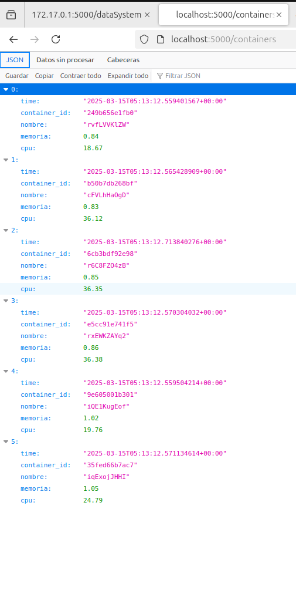
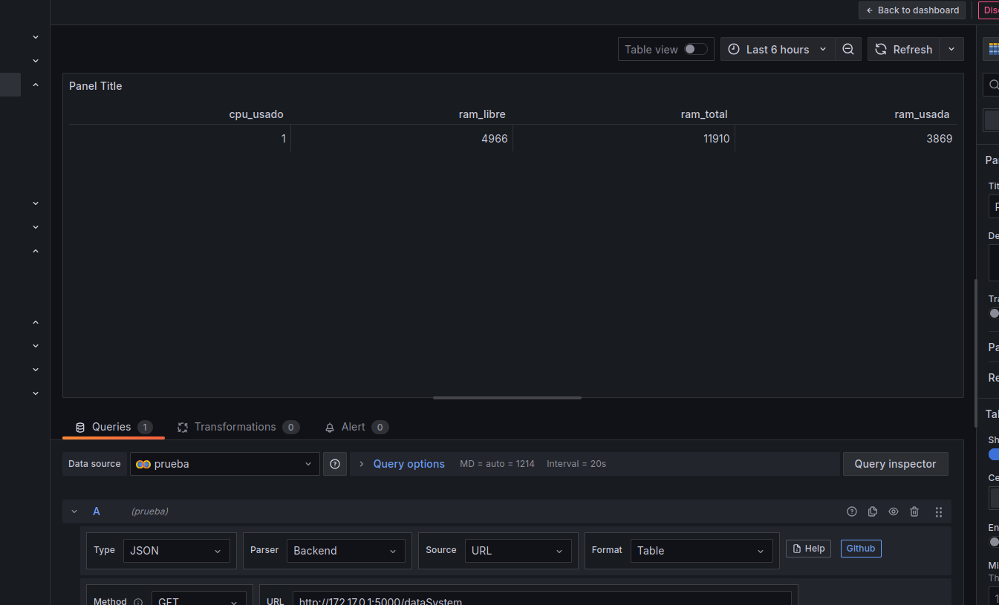

# MANUAL TECNICO

# PROYECTO 1 - Gestor de contenedores

## Objetivos

- **Conocer el Kernel de Linux mediante módulos de C.**
- **Hacer uso del lenguaje de programación Rust para la gestión del sistema.**
- **Comprender el funcionamiento de los contenedores usando Docker.**
- **Comprender el funcionamiento de los scripts de bash para la automatización de procesos.**

## Requerimientos para el proyecto

- **Docker**: Instalación de Docker para la creación, administración y manejo de contenedores.
- **Rust**: Instalación del lenguaje de programación Rust para el desarrollo del servicio de gestión de contenedores.
- **Python y FastAPI**: Instalación de Python y el framework FastAPI para el desarrollo del contenedor administrador de logs.
- **Bash**: Conocimientos y entorno para ejecutar scripts de bash para la automatización de procesos.
- **Conocimientos de Módulos de Kernel**: Habilidad para crear y cargar módulos en el kernel de Linux para capturar y leer métricas de los contenedores.
- **Permisos de Superusuario**: Acceso a un terminal en modo superusuario para la ejecución de ciertas tareas que requieren privilegios elevados.
- **Volúmenes de Docker**: Uso de volúmenes de Docker para el almacenamiento y acceso compartido de archivos de registros entre el contenedor y la máquina host.

## Script

Se encarga de generar 10 contenedores aleatoriamente entre distintos tipos de imagenes las cuales estresan nuestra computadora:

   ```bash
#!/bin/bash

SCRIPT_LOG="script_containers.log"

generate_random_name() {
    cat /dev/urandom | tr -dc 'a-zA-Z0-9' | fold -w 9 | head -n 1
}

# Tipos de contenedores
CONTAINER_TYPES=("cpu" "ram" "io" "disk")

echo "---------------------------------------------------------------------" >> $SCRIPT_LOG

run_containers() {
    # Generar 10 contenedores
    for i in {1..10}; do
        # Seleccionar un tipo de contenedor aleatorio
        RANDOM_TYPE=${CONTAINER_TYPES[$RANDOM % ${#CONTAINER_TYPES[@]}]}
        
        # Nombre aleatorio para el contenedor
        RANDOM_NAME=$(generate_random_name)

        case $RANDOM_TYPE in
            "cpu")
                PREFIX="c"
                ;;
            "ram")
                PREFIX="r"
                ;;
            "io")
                PREFIX="i"
                ;;
            "disk")
                PREFIX="d"
                ;;
        esac

        CONTAINER_NAME=${PREFIX}${RANDOM_NAME}

        case $RANDOM_TYPE in
            "cpu")
                docker run -d --cpus="0.2" --memory="50m" --name $CONTAINER_NAME containerstack/alpine-stress stress --cpu 1
                ;;
            "ram")
                docker run -d --cpus="0.2" --memory="50m" --name $CONTAINER_NAME containerstack/alpine-stress stress --vm 1 --vm-bytes 50MB
                ;;
            "io")
                docker run -d --cpus="0.2" --memory="50m" --name $CONTAINER_NAME containerstack/alpine-stress stress --io 2
                ;;
            "disk")
                docker run -d --cpus="0.2" --memory="50m" --name $CONTAINER_NAME containerstack/alpine-stress stress --hdd 2
                ;;
        esac

        # Registrar las creaciones del container
        echo "$(date): Contenedor $CONTAINER_NAME de tipo $RANDOM_TYPE creado." >> $SCRIPT_LOG
    done
}

# Primera ejecución 
run_containers

sleep 30

# Segunda ejecución
run_containers
   ```

## Modulo de Kernel
Con el modulo de kernel hecho en c recopilamos informacion de los contenedores que estan en ejecucion en nuestra computadora.

Partes del moudulo implementado:



## Servicio de Rust
El servicio gestiona contenedores creando al inicio un contenedor administrador de logs y ejecutando un bucle infinito que se detiene con una señal (como Ctrl + C). Durante este bucle, se realizan análisis y procedimientos cada 30 segundos, como leer y analizar el archivo de métricas del kernel, generar logs, y enviar peticiones HTTP al contenedor administrador de logs.





## Compose - Python / Contenedor para adminsitrar los logs
API desarrollada con Python utilizando FastAPI la cual nos ayuda a recibir los que nos manda nuestro servicio de rust almacenarlo en formato json y mandarlo como otro endpoint para que la informacion pueda ser usada por grafana.




## Grafana
Utilizamos este contenedor para poder visualizar en tablas o graficas los datos de los logs enviados por nuestra api.





