## ¿Cómo funciona Kafka?
Kafka es una plataforma de mensajería distribuida que permite publicar, almacenar y consumir flujos de datos en tiempo real. Utiliza un modelo basado en **topics** y **particiones**, donde los **productores** envían mensajes y los **consumidores** los leen de forma eficiente y tolerante a fallos.

## ¿Cómo difiere Valkey de Redis?
Valkey es un fork (derivación) de Redis mantenido por la comunidad tras el cambio de licencia de Redis. Aunque actualmente son muy similares en funcionalidad, **Valkey sigue siendo 100% open source**, mientras que Redis tiene una licencia más restrictiva para usos comerciales.

## ¿Es mejor gRPC que HTTP?
gRPC es mejor que HTTP en sistemas donde se requiere **alta eficiencia y comunicación entre servicios**, ya que utiliza **Protocol Buffers** (binario) y permite **llamadas bidireccionales y streaming**. Sin embargo, HTTP (REST) es más simple y ampliamente compatible con clientes web, para la aplicacion en este proyecto si resulto util pero solo se aplica en el deployment de go, la diferencia se podia ver en los logs en los de la api en go eran casi inmediatos en la api de rust se notaba un cierto retraso.

## ¿Hubo una mejora al utilizar dos réplicas en los deployments de API REST y gRPC? Justifique su respuesta.

### Con 1 Replica
1 replica en el cluster **-> go-api-deployment-866f7f5695-6r76b**
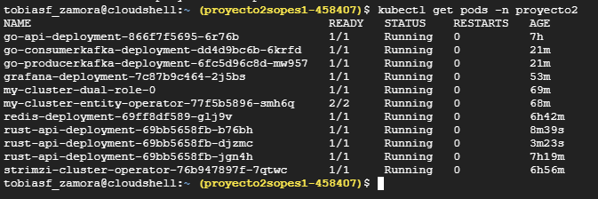
Creacion de prueba con un maximo de 1000 y 10 u/s
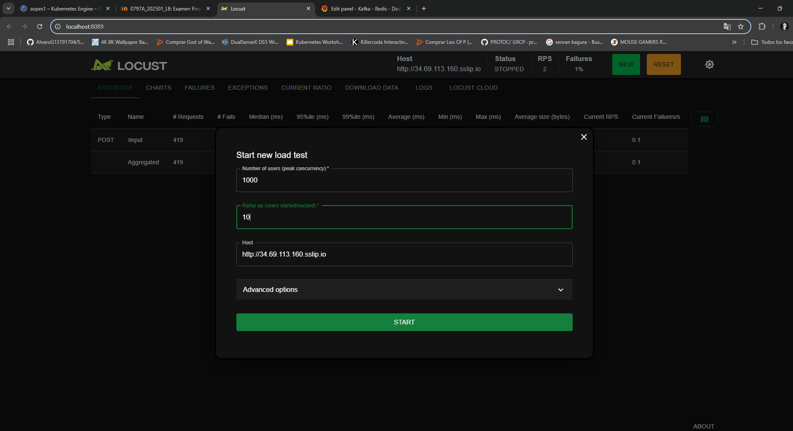
Dashboard en grafana al inicio
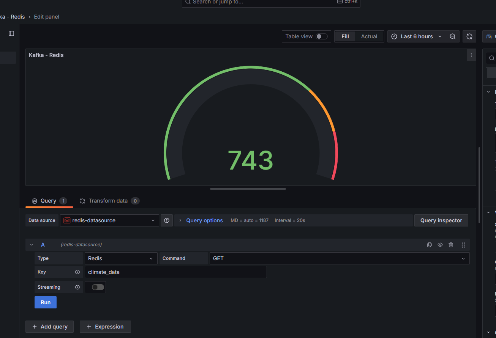
Dashboard en grafana al final de aproximadamente 2 minutos
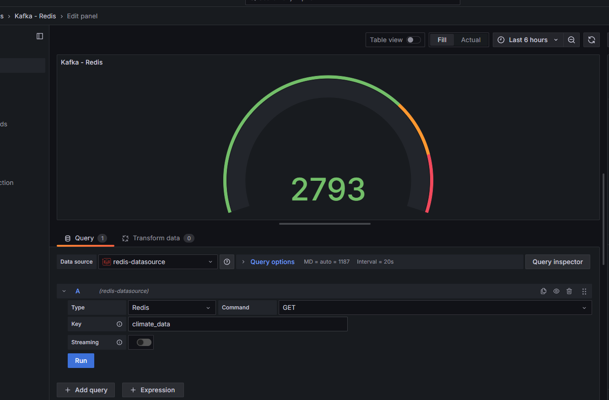

### Con 2 Replicas
2 replicas en el cluster: 
**go-api-deployment-866f7f5695-6r76b**
**go-api-deployment-866f7f5695-j7dz4**
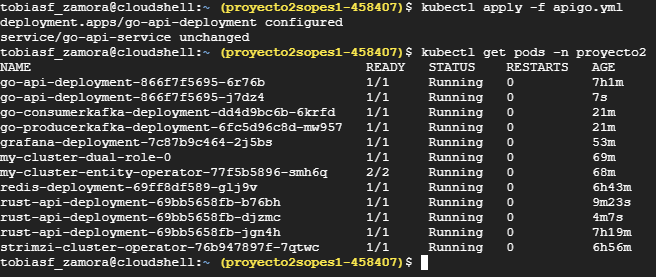

Dashboard en grafana al inicio se aplico la misma prueba en locust
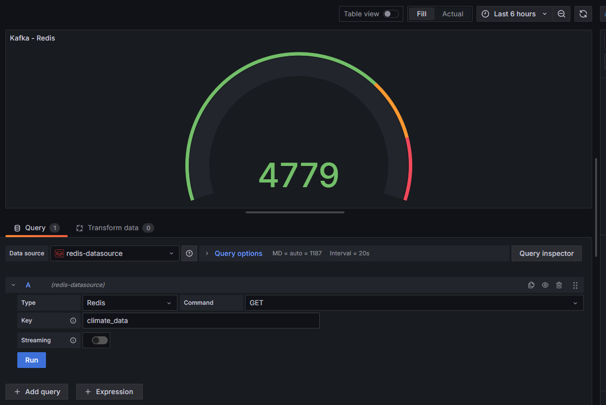

Fin de la prueba en locust
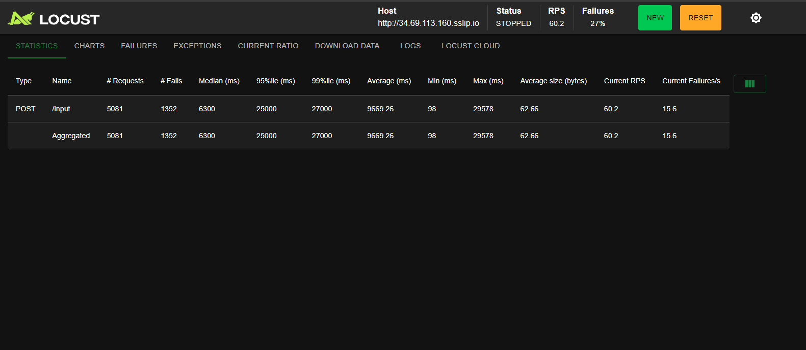

Dashboard en grafana al final de aproximadamente 2 minutos
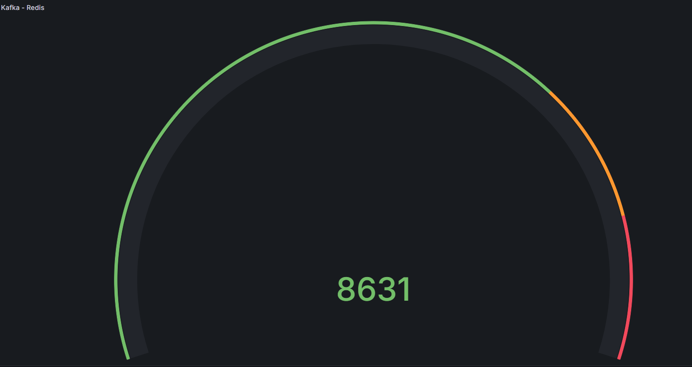

**Podemos decir que si hubo una mejoria hubo menos fallos y mas respuestas.**

## Para los consumidores, ¿Qué utilizó y por qué?

Solamente realize el consumidor de **Kafka**

Utilicé un consumidor escrito en Go utilizando las siguientes herramientas:

- **Librería `segmentio/kafka-go`**: Para conectarme y leer mensajes desde Kafka de forma eficiente y simple en Go. Esta librería facilita la lectura y confirmación de mensajes desde un topic en Kafka, utilizando una configuración sencilla.

- **Redis (`go-redis`)**: Para almacenar el conteo de los mensajes recibidos desde Kafka. Se uso Redis, por su velocidad y eficiencia como base de datos en memoria permite escribir y consultar datos casi en tiempo real.

- **UUID (`github.com/google/uuid`)**: Para generar un `GroupID` único cada vez que el consumidor se ejecuta. Esto permite que el consumidor reciba siempre los mensajes más recientes desde Kafka (comportamiento tipo "último offset").

Este enfoque me permitió consumir mensajes en tiempo real, procesarlos de manera sencilla y registrar cuántos mensajes se han recibido usando Redis como backend de almacenamiento ligero.

## Harbor
Maquina virtual para harbor
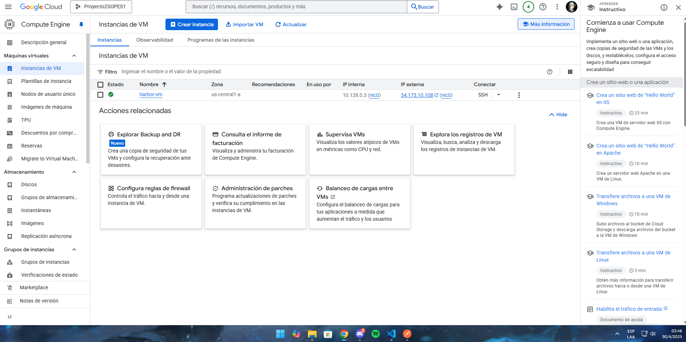
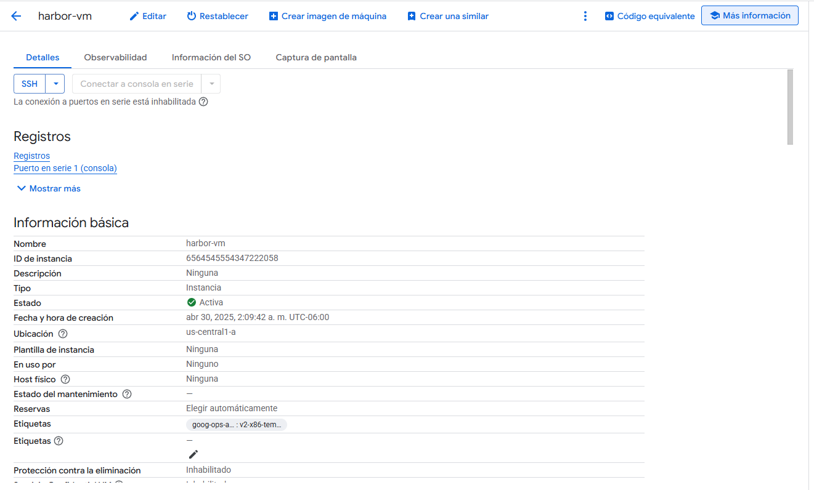
Acceso **https** a el dashboard de Harbor **--> https://34-173-10-108.sslip.io**
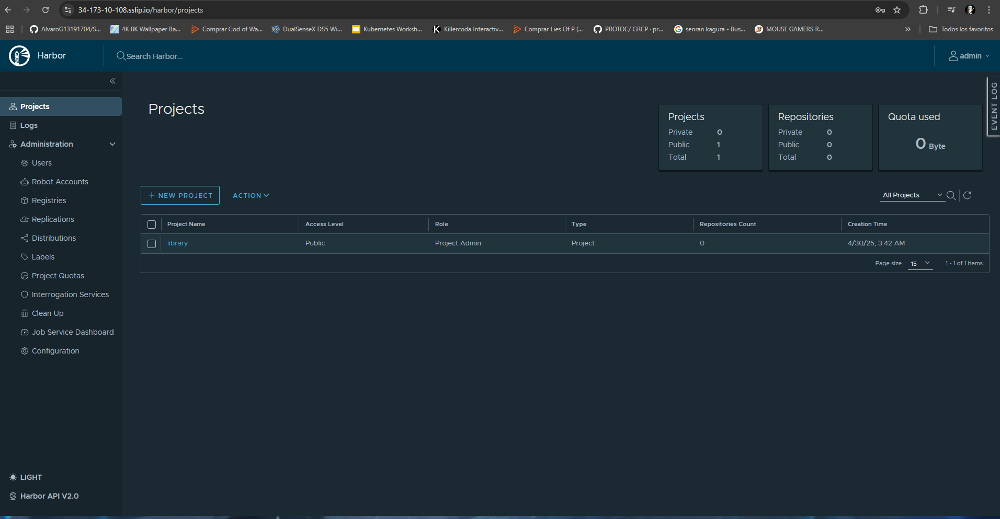
Imagenes utilizadas en el proyecto 2 y almacenadas en el proyecto de Harbor **sopes1p2**
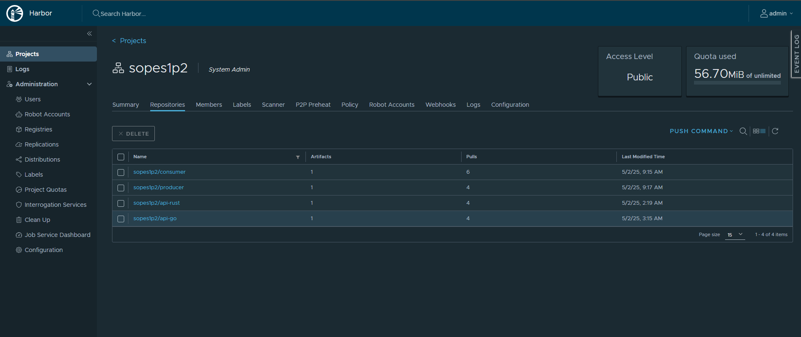

## Cluster GCP

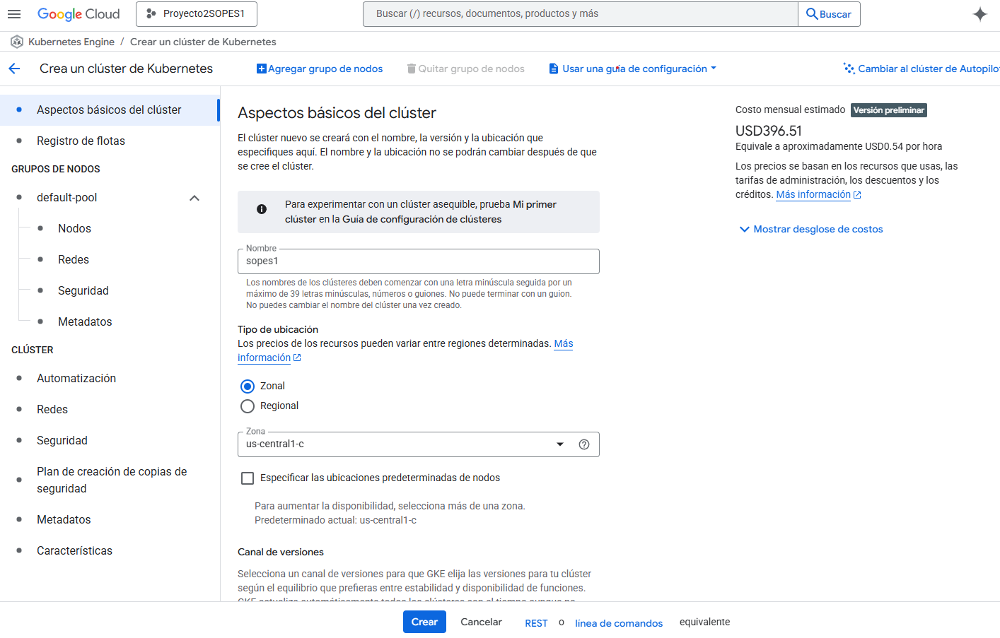
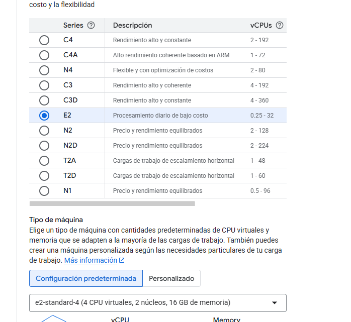

## Entrada a API REST en RUST
El dominio expuesto por el Ingress Controller es: **http://34.69.113.160.sslip.io**

Endpoint tipo post para publicar: **http://34.69.113.160.sslip.io/input**

## Entrada a GRAFANA
El dominio expuesto por el Ingress Controller es: **34.69.113.160.nip.io**
